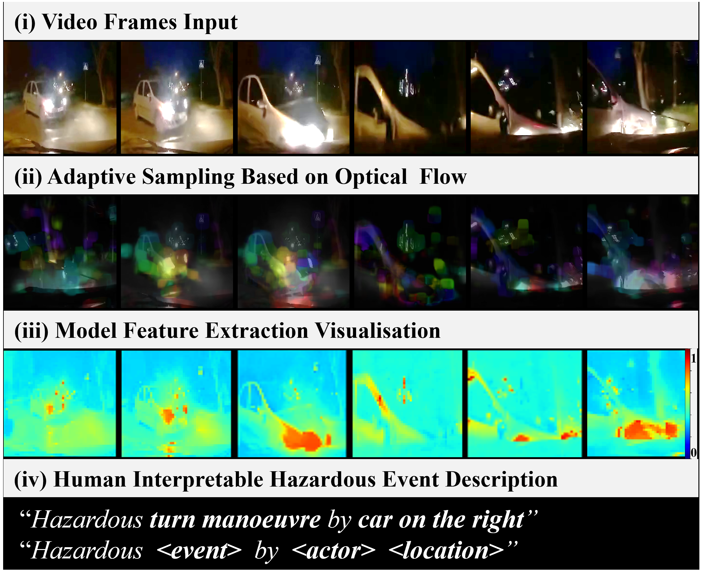

# HazardVLM: A Video Language Model for Real-Time Hazard Description in Automated Driving Systems 

### Overview


This repository is the official implementation of HazardVLM: A Video Language Model for Real-Time Hazard Description in Automated Driving Systems.

We propose a hazard-focused video language model (HazardVLM) in an end-to-end trainable architecture. HazardVLM provides human-interpretable natural language warnings for road hazards to warn and inform the user of incoming dangers. HazardVLM is trained on a real dataset of collision videos and and takes (i) raw video input and applies (ii) adaptive sampling using optical flow to sample frames with significant motion to reduce the complexity of video analysis. The sampled frames are then passed to a 3D CNN to extract visual and temporal video features, with (iii) visualisable spatial features to provide interpretability. Finally, the extracted video features are used by the transformer decoder to autoregressively generate a (iv) hazardous event description. 

### Model Visualizer


Using Eigen-CAM heatmaps, we can visualise the most activated regions and important regions extracted by the model across different layers of the X3D encoder at layers (a) the first convolutional block and (b) the third block.

---


## Table of contents
- [1. Installation]((#1.-installation))
- [2. Models](#2-models)
- [3. Dataset](#3-dataset)
- [4. Training and Evaluation](#4-training-and-evaluation)
- [5. Visualizing the Extracted Features](#5-visualizing-the-extracted-features)

---


### 1. Installation

Conda Environment Setup   

```         
conda create -n HazardVLM python=3.9.13
conda activate HazardVLM       
conda install pip
conda install pytorch=2.1.0 torchvision=0.16.0 torchaudio pytorch-cuda=11.8 -c pytorch -c nvidia
conda install -c conda-forge scikit-learn=1.3.2 
pip install -r requirements.txt

```


Other dependencies:
C++ development tools: https://visualstudio.microsoft.com/visual-cpp-build-tools/


---
 
### 2. Models
We release our the models for download at:
[https://drive.google.com/drive/folders/1ypCRsIH9prbcRH8CBhGi4hhVE5dQNWV4?usp=drive_link]

Place them in `src/models` directory.

- HazardVLM: `HazardVLM_69613_A.pt`
- HazardVLM (AS50)*: `HazardVLM_AS50_65604_A.pt`
- HazardVLM (AS75)*: `HazardVLM_AS75_62701_A.pt`

*(AS): Adaptive sampling

---

### 3. Dataset
We release our the datasets for download at:
[https://drive.google.com/drive/folders/1ypCRsIH9prbcRH8CBhGi4hhVE5dQNWV4?usp=drive_link]

Create a `src/datasets` directory and place datasets in there.

__DoTA-HEC BASE DATASET:__
- `VLM_DOTA_BASE_DATA_HCLASS_T10_65_7901.json`
- `HCLASS_T10_65/`


__DoTA-HEC Adaptive Sampling (AS*):__
*Preprocessed for faster training and evaluation. 

__Uniform__
- `VLM_DOTA_AS25_UNIF_HCLASS_T10_65_7901.json`
- `VLM_DOTA_AS50_UNIF_HCLASS_T10_65_7901.json`
- `VLM_DOTA_AS75_UNIF_HCLASS_T10_65_7901.json`
- `AS25_UNIF_HCLASS_T10_65/`
- `AS50_UNIF_HCLASS_T10_65/`
- `AS75_UNIF_HCLASS_T10_65/`

__Highest Value__
- `VLM_DOTA_AS25_MEDI_HCLASS_T10_65_7901.json`
- `VLM_DOTA_AS50_MEDI_HCLASS_T10_65_7901.json`
- `VLM_DOTA_AS75_MEDI_HCLASS_T10_65_7901.json`
- `AS25_MEDI_HCLASS_T10_65/`
- `AS50_MEDI_HCLASS_T10_65/`
- `AS75_MEDI_HCLASS_T10_65/`

__Random__
- `VLM_DOTA_AS25_RAND_HCLASS_T10_65_7901.json`
- `VLM_DOTA_AS50_RAND_HCLASS_T10_65_7901.json`
- `VLM_DOTA_AS75_RAND_HCLASS_T10_65_7901.json`
- `AS25_RAND_HCLASS_T10_65/`
- `AS50_RAND_HCLASS_T10_65/`
- `AS75_RAND_HCLASS_T10_65/`


Dataset Structure VLM
List of dictionaries, where each dictionary represents a scene

```python
scene_dict =  {
              'filename': str, # file path
              'metadata': dict # file data
              }

# where:
# if class 0:
metadata: {
            'filename': filename,
            'class_label': 0, 
            'caption': caption, # caption for video

            'night': data['night'],
            'haz_actor_bbox': [], 
          }

# if class 1:
metadata: {
        'filename': str, # video filename
        'class_label': int, # event class
        'caption': str, # caption for video
        '<event_type>': str, # hazard category
        '<actor>': str, # actor category
        '<location>': str, # actor location
        
        'ego_involve': bool, # if the ego vehicle is involved in the crash
        'night': bool, # night time
        'anomaly_start': int, # time of anomaly start from the original video
        'anomaly_end': int, # time of the anomaly end from the original video
        'accident_name': str, # name of accident type from the original video
        'list_actor_cat': list, # list of actor categories
        'haz_actor_bbox': list, # list of actor bounding box data
        }
```

---


### 4. Training and Evaluation
To train and evaluate HazardVLM.

Ensure the initialisation config file `src\config\init_config.yaml` has the following parameters:

```python

# MODEL CONFIG
mode: 'vlm' # 'vlm', 'benchmark'
cudnn_deterministic: True # true will have reproducible but slow training
proc_mode: 1 # {1: train and eval, 2: eval on pre-trained model, 3: transfer learning on pre-trained model}
target_gpu: 'cuda:0' # set gpu to use in multi-gpu setup 'cuda:0', 'cuda:1'

run_name: '<INSERT DESIRED RUN NAME HERE>'
single_run_bool: 1 # {0: sweep, 1: single run}
wandb_bool: 1 #  {0: wandb logging* off, 1: wandb logging* on} *wandb account needed to log and view evaluation results
wandb_account_name: '<INSERT WANDB ACCOUNT NAME HERE>' # *wandb account name
compile: 1 # {0: no compile, 1: compile} # PyTorch JIT compile model for faster inference at deployment. Currently only supported on linux at time of publication


```
Note 1: For easy visualisation and logging of evaluation results on the cloud, we utilise the library wandb. As such, to view the resulting evaluation results, a free wandb account will need to be created an inserted in the lines, as instructed in the comments. [https://wandb.ai/]

Note 2: To run a pretrained model, `set proc_mode: 2` in the initialisation config file `src\config\init_config.yaml` and ensure the correct model name is given in `model_load_path` within the configuration file within  `src\config\model_config_vlm.yaml`


Then run using the following terminal command inside the project folder:

```
cd src
python main.py
```

During training and evaluation, progress will be logged as exemplified below:

```

Total Trainable Params: 2.215625e+08
537 Train/Val/Test Split Information:
538 - Train: 5730, Val: 1228, Test: 1228
539 *** Mixed point precision on ***
540 Model save name models/DOTA_52849_A.pt

541 Training ---------------------
542 17:28 Epoch 1/50 | ETA 23.22 hours (27.32 min/epoch) | Train Loss 3.5884 | Val Loss 4.3035 |lr 0.001 | TF Ratio 1.00
543 -- Model Predict (Val): [46, 59, 46, 59, 46, 46, 46, 59, 59, 0]  the scene the scene the the the scene scene
544 -- Ground Truth  (Val): [1, 63, 95, 110, 65, 70, 76, 96, 2, 0] Hazardous lane exit by car on right

545 17:46 Epoch 2/50 | ETA 14.99 hours (17.99 min/epoch) | Train Loss 2.2270 | Val Loss 5.3719 |lr 0.001 | TF Ratio 1.00
546 -- Model Predict (Val): [1, 1, 47, 47, 47, 47, 47, 47, 47, 0] NoNoNoNoNoNoNo
547 -- Ground Truth  (Val): [1, 63, 95, 110, 65, 70, 76, 96, 2, 0] Hazardous lane exit by car on right

...

708 08:07 Epoch 50/50 | ETA 0.60 hours (17.85 min/epoch) | Train Loss 0.1498 | Val Loss 1.1008 |lr 0.00025 | TF Ratio 0.00
703 -- Model Predict (Val): [1, 63, 95, 110, 65, 70, 76, 96, 2, 0] Hazardous lane exit by car on right
704 -- Ground Truth  (Val): [1, 63, 95, 110, 65, 70, 76, 96, 2, 0] Hazardous lane exit by car on right


712 Evaluation 1. full video ---------------------
713 {'testlen': 8596, 'reflen': 8596, 'guess': [8596, 7368, 6140, 4912], 'correct': [6537, 5064, 3956, 3020]}
714 ratio: 0.9999999999998836

715 Evaluation 2. video with end frames removed ---------------------
716 {'testlen': 8596, 'reflen': 8596, 'guess': [8596, 7368, 6140, 4912], 'correct': [6207, 4912, 3903, 3008]}
717 ratio: 0.9999999999998836

725 FLOPs Calculation ---------------------
718 [INFO] Register count_convNd() for <class 'torch.nn.modules.conv.Conv3d'>.
719 [INFO] Register count_normalization() for <class 'torch.nn.modules.batchnorm.BatchNorm3d'>.
720 [INFO] Register zero_ops() for <class 'torch.nn.modules.activation.ReLU'>.
721 [INFO] Register count_linear() for <class 'torch.nn.modules.linear.Linear'>.
722 [INFO] Register zero_ops() for <class 'torch.nn.modules.dropout.Dropout'>.
723 [INFO] Register zero_ops() for <class 'torch.nn.modules.container.Sequential'>.
724 [INFO] Register count_normalization() for <class 'torch.nn.modules.normalization.LayerNorm'>.

726 Evaluation metrics logged
727 Finished ---------------------

```


### 5. Visualizing the Extracted Features

After training the model, amend the model visualisation configuration file to match the training parameters at: `src\config\model_config_model_vis.yaml`. With the correct model load name at `model_load_path`.

Then run model visualisation using the following terminal command inside the project folder:

This will run the model on the 8 video examples located within `src\modules\model_visualiser\video` which includes a diverse range of scenes. The user can also add their own scenes for evaluation as the script will iterate through all .mp4 files within the folder. Note they must be of the same resolution as the training resolution. E.g., 200 x 200. 

```
cd src
python model_visual.py
```

The output visualisations will be created in `src/modules/model_visualiser/output`

The current layers being extracted for visualisation are found in `src\modules\processing_layers\model_vlm.py`:

```

dict_extra_layers = { 
                    # Extra layers to return for model visualisation
                    'blocks.1.res_blocks.0.branch1_conv': 'b0',
                    'blocks.1.res_blocks.0.add': 'b0_add',
                    'blocks.2.res_blocks.0.branch1_conv': 'b2',
                    'blocks.2.res_blocks.0.branch2.conv_a': 'b2_a',
                    'blocks.2.res_blocks.0.branch2.conv_b': 'b2_b',
                    'blocks.2.res_blocks.0.branch2.conv_c': 'b2_c',
                    'blocks.2.res_blocks.0.add': 'b2_add',
                    'blocks.3.res_blocks.1.add': 'b3_add',
                    }
```

To amend the layers extracted and visualised, add extra layers to `dict_extra_layers`. Add and remove as needed. The visualisations will have the layer name appended to the image output for ease of viewing.

Full list of layers to select from in:
- 'src\modules\model_visualiser\x3d_large_layers.txt'
- 'src\modules\model_visualiser\x3d_medium_layers.txt'


### VS Code Run and Debug Settings
For additional modification support, the VS code run and debug can be utilised using the following `launch.json` settings:

```
{
    "version": "0.2.0",
    "configurations": [
        {
            "name": "Main",
            "type": "python",
            "request": "launch",
            "program": "main.py",
            "cwd": "${workspaceFolder}/src",
            "console": "integratedTerminal",
            "justMyCode": true
        }
    ]
}

```
